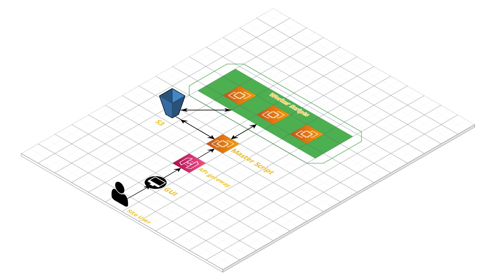
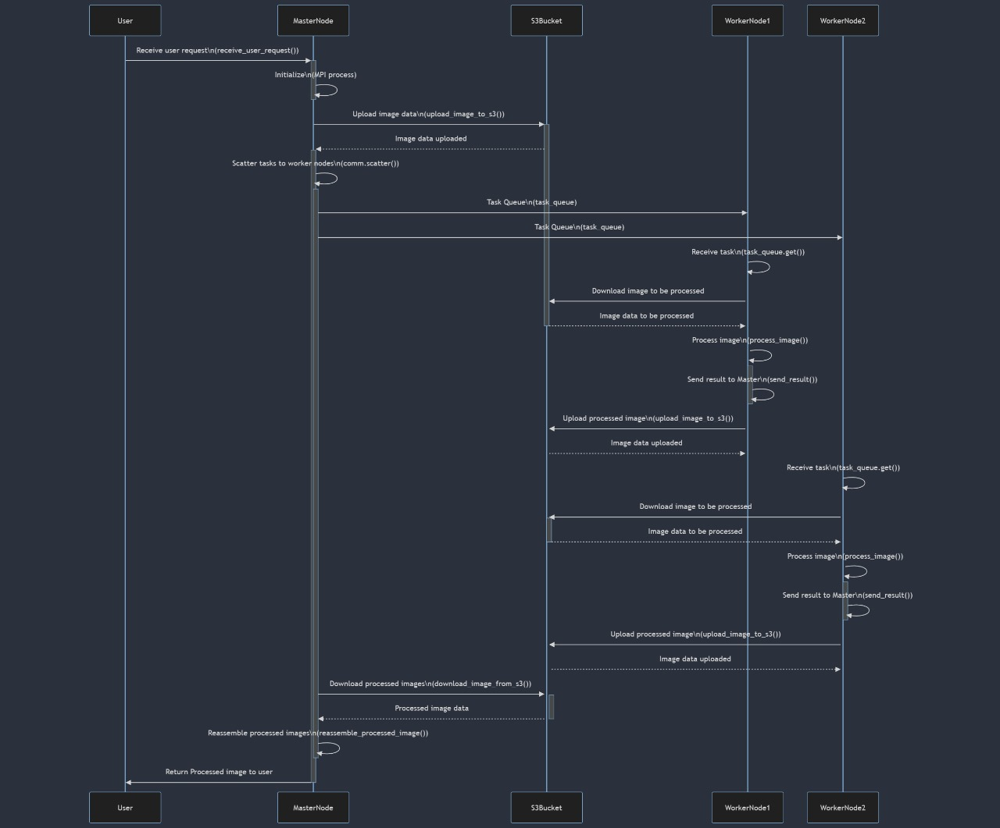

# Image Uploader and Processor

## Overview

This Python application is designed to upload images to an Amazon S3 bucket, process them using various operations, and then download and display the processed images in a GUI. The application leverages the power of AWS services (S3 for storage and SQS for message queuing) and integrates them with a local Python script to create a seamless image processing pipeline. Additionally, the image processing tasks are distributed across an MPI cluster on the cloud, allowing for efficient processing of large volumes of images.

## Demo Video

https://drive.google.com/file/d/1afcznIvJK6Fy9OwlnO1un3eGq97oe5wx/view?usp=sharing

## System Sequence Diagram

## System Architecture Diagram

## Features

- **Cloud-Based MPI Cluster**: The application utilizes a cloud-based MPI (Message Passing Interface) cluster for distributed image processing. This allows the application to leverage multiple processing units for concurrent image processing, significantly improving performance for large volumes of images.

- **Image Upload**: Users can upload single or multiple images from their local machine to an S3 bucket.

- **Image Processing**: Users can choose from a variety of image processing operations, including blur, erosion, dilation, color inversion, and edge detection.

- **Message Queuing**: The application uses Amazon SQS to queue messages containing the S3 location of the uploaded images and the selected operation. This ensures that even if multiple images are uploaded at once, they will be processed in the order they were received.

- **Image Download and Display**: After an image has been processed, it is downloaded from the S3 bucket and displayed in the GUI. This allows users to see the results of their selected operation in real time.

- **Multithreading**: The application uses multithreading to process SQS messages and update the GUI simultaneously, resulting in a smooth and responsive user experience.

## Technical Details

The application is written in Python and uses several libraries, including boto3 for interacting with AWS services, tkinter for creating the GUI, and cv2 and PIL for handling and processing images.

